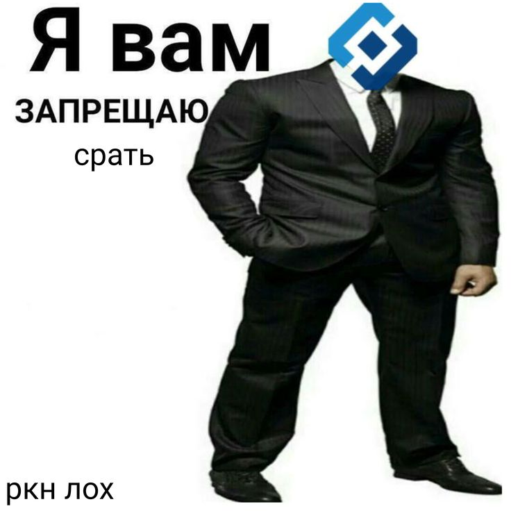

<p align="center">
  
</p>

<h1 align="center">VPN Bot</h1>

<p align="center">
  Self-hosted Telegram VPN service on VLESS + Reality<br/>
  <sub>Multi-server &bull; Split-tunnel &bull; One-tap connect &bull; Crypto payments</sub>
</p>

<p align="center">
  <a href="#quick-start">Quick Start</a> &bull;
  <a href="#features">Features</a> &bull;
  <a href="#architecture">Architecture</a> &bull;
  <a href="#deploy-scripts">Deploy</a> &bull;
  <a href="#donate">Donate</a>
</p>

---

## Why

VPN protocols get blocked. Configs break. Users can't set things up. This project solves all three:

- **VLESS + Reality** — looks like regular HTTPS to any DPI, passes through even the strictest filters
- **Dual transport** (TCP + gRPC) — if one gets throttled, the other works
- **Split-tunnel** — Russian sites go direct, no "turn off your VPN" popups from banks
- **Subscription URL** — one link, paste into any V2Ray client, always up to date
- **One-click server provisioning** — enter SSH creds in admin panel, Xray installs itself

## Features

| | |
|---|---|
| **Telegram Bot** | Single-message UI, trial activation, subscription purchase, config delivery (aiogram 3) |
| **Subscription Links** | Standard base64 V2Ray format — works with Hiddify, V2RayNG, Happ, Streisand |
| **VLESS + Reality** | Undetectable protocol with TCP and gRPC transports per server |
| **Split-Tunnel** | `geoip:ru` + `geosite:category-ru` routing rules on server side |
| **Multi-Server** | Paid users get all servers, trial — one. Add servers in 30 seconds |
| **Admin Panel** | Users, keys, servers, payments, referrals, settings — all in browser |
| **Auto-Provisioning** | IP + SSH password → fully configured Xray node with Reality |
| **Crypto Payments** | USDT via [@CryptoBot](https://t.me/CryptoBot) — 7 / 30 / 90 day plans |
| **Referrals** | Invite link + bonus days when a friend buys a plan |
| **Health Monitor** | Background server checks, Telegram alerts to admins on failure |
| **Expiry Alerts** | 3-day warning + post-expiry notification to users via Telegram |

## Architecture

```
Telegram User
    │
    ▼
┌──────────┐     HTTP      ┌──────────────────┐     SSH      ┌──────────────┐
│  TG Bot  │ ◄──────────► │  FastAPI Backend  │ ◄──────────► │  Xray Server │
│ aiogram 3│               │  + Admin Panel    │              │  VLESS+Reality│
└──────────┘               │  + SQLite         │              │  TCP + gRPC  │
                           └──────────────────┘              └──────────────┘
                                    │
                           ┌────────┴────────┐
                           │  /vpn/sub/{token}│  ← Subscription URL
                           │  (public)        │    for V2Ray clients
                           └─────────────────┘
```

## Quick Start

### 1. Clone and configure

```bash
git clone https://github.com/napalen0/vpn-bot.git
cd vpn-bot
cp .env.example .env
# Edit .env — set BOT_TOKEN, API_SECRET, SESSION_SECRET, PUBLIC_BASE_URL
```

### 2. Install dependencies

```bash
python3 -m venv .venv && source .venv/bin/activate
pip install -r requirements.txt
```

### 3. Start

```bash
# Backend (from vpn-bot/backend/)
cd backend
python3 -m uvicorn app.main:app --host 127.0.0.1 --port 8080

# Bot (from vpn-bot/, separate terminal)
python3 -m bot.main
```

Admin panel: `http://127.0.0.1:8080/admin`

### 4. Add a VPN server

**Auto-provision (recommended):**

1. Get any VPS with Ubuntu 22.04+
2. Admin panel → Servers → "Auto: SSH + Install Xray"
3. Enter IP, SSH port, login, password
4. Done — Xray with VLESS+Reality is live in ~30 seconds

**Manual:**

1. Run `deploy/install_xray_vpnbot.sh` on your VPS
2. Copy the `VPNBOT_JSON` output
3. Add server in admin panel with the public key and short ID

### 5. Subscription URL (recommended)

Point a domain to backend with nginx:

```nginx
location /vpn/sub/ {
    proxy_pass http://127.0.0.1:8080;
    proxy_set_header Host $host;
    proxy_set_header X-Real-IP $remote_addr;
}
```

Set `PUBLIC_BASE_URL=https://vpn.example.com` in `.env`.

Users paste one link into their V2Ray app — configs update automatically when you add/remove servers.

## Server Display

Servers appear with clean names in V2Ray clients:

```
🇫🇮 Helsinki
🇫🇮 Helsinki gRPC
🇳🇱 Amsterdam
🇳🇱 Amsterdam gRPC
```

Set `name` and `country` (ISO 3166-1 alpha-2) per server in admin panel.

## API

All endpoints require `X-API-Key` header except subscription URLs.

| Method | Path | Description |
|--------|------|-------------|
| `POST` | `/user/create` | Register user |
| `GET` | `/user/telegram/{id}` | Get user by Telegram ID |
| `POST` | `/vpn/create_trial` | Activate free trial |
| `POST` | `/vpn/create_paid` | Create paid subscription |
| `POST` | `/vpn/vless_export` | Get VLESS configs |
| `GET` | `/vpn/sub/{token}` | Subscription URL (public) |
| `POST` | `/vpn/sync_pool` | Sync keys across servers |
| `GET` | `/catalog` | List available plans |
| `POST` | `/payment/create_invoice` | Create CryptoPay invoice |
| `POST` | `/payment/webhook` | CryptoPay callback |

## Deploy Scripts

| Script | What it does |
|--------|-------------|
| `install_xray_vpnbot.sh` | Full Xray + VLESS Reality + split-tunnel setup |
| `remote_add_vless_client.sh` | Add UUID to all inbounds |
| `remote_bulk_add_vless_clients.sh` | Bulk-add UUIDs after reinstall |
| `remote_remove_vless_client.sh` | Remove UUID on expiry |
| `remote_set_reality_dest.sh` | Change Reality masquerade target |
| `remote_apply_inbound_port.sh` | Change listening port |
| `remote_remove_xray_vpnbot.sh` | Uninstall Xray from server |

## Split-Tunnel

Xray routing rules send Russian traffic direct (not through VPN):

- `geosite:category-ru` — Russian websites
- `geosite:category-gov-ru` — Government services
- `geoip:ru` — Russian IP ranges

Banks, government portals, delivery apps — all work without disabling VPN.

Geo-data: [Loyalsoldier/v2ray-rules-dat](https://github.com/Loyalsoldier/v2ray-rules-dat).

## Project Structure

```
vpn-bot/
├── backend/app/
│   ├── main.py              # FastAPI + startup tasks
│   ├── models.py            # SQLAlchemy models
│   ├── database.py          # DB engine + auto-migrations
│   ├── admin_routes.py      # Admin panel (Jinja2)
│   ├── routers/             # API endpoints
│   │   ├── vpn.py           # VPN keys + subscription
│   │   ├── payment.py       # CryptoPay integration
│   │   └── ...
│   ├── services/            # Business logic
│   │   ├── vpn_core.py      # VLESS URI builder, pool mgmt
│   │   ├── xray_ssh.py      # SSH operations on Xray nodes
│   │   ├── vless_bundle.py  # Subscription export (base64)
│   │   └── ...
│   └── templates/admin/     # Admin panel HTML
├── bot/
│   ├── main.py              # Bot entry point
│   ├── locale.py            # i18n strings (RU)
│   ├── handlers/menu.py     # All bot handlers
│   ├── keyboards.py         # Inline keyboards
│   └── middlewares/         # Channel gate
├── deploy/                  # Server provisioning scripts
├── .env.example             # Configuration template
└── requirements.txt
```

## Tech Stack

**Python 3.11+** &bull; FastAPI &bull; aiogram 3 &bull; SQLAlchemy 2 (async) &bull; SQLite &bull; Xray-core &bull; asyncssh &bull; CryptoPay API

## Security

- Change all secrets in `.env` before deploying
- SSH passwords encrypted with Fernet (tied to `SESSION_SECRET`)
- Use HTTPS for the subscription endpoint in production
- `.env` and `*.db` are in `.gitignore`

---

## Donate

If this project was useful to you — you can support its development:

**Bitcoin (BTC):**
```
bc1qxt2jyf7w7wmf8y96875y9yk5sas5gqss4um48j
```

## License

[MIT](LICENSE) — use it, fork it, build your own VPN service. Free and open source.
